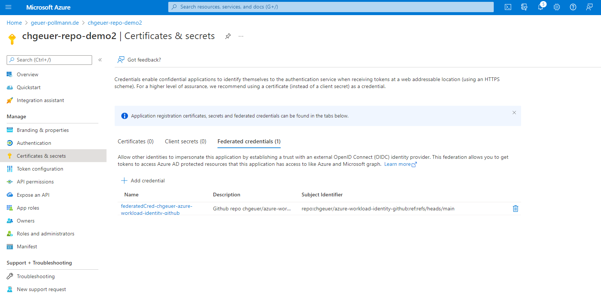
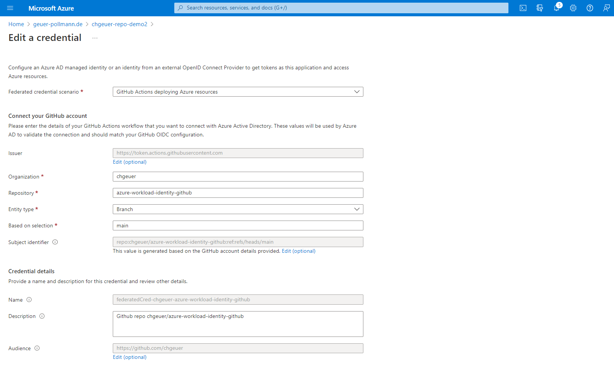
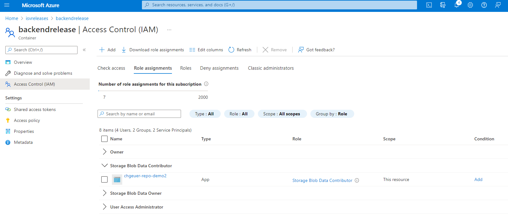
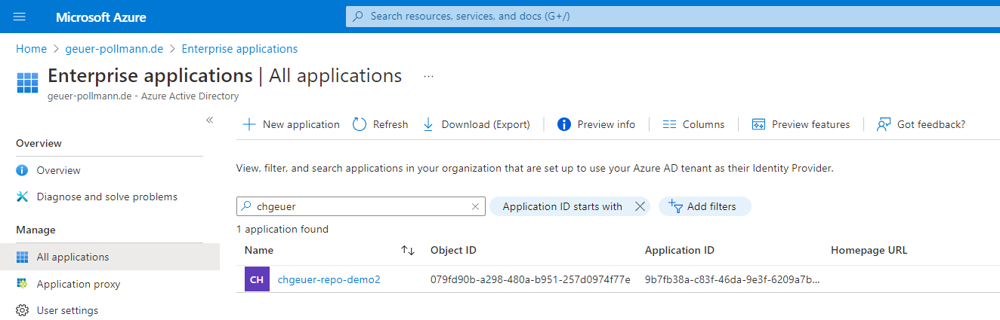

# Demo of [Azure AD Workload Identity Federation with GitHub](https://github.com/chgeuer/azure-workload-identity-github)

> Upload a file from a GitHub action into a storage account without having a credential in GitHub.

## Goal

- Have a GitHub Action upload files into an Azure Blob Storage Account
  - Do it without having sensitive information in GitHub, by using [Azure Workload Identity Federation](https://docs.microsoft.com/en-us/azure/active-directory/develop/workload-identity-federation-create-trust-github?tabs=azure-portal)
  - Show how to do it using proper GitHub Actions
  - Show how to do it using blain bash and curl

## High-level steps

- Create an app in Azure Active Directory
  - Create a federated credential for that app
- Authorize the app to be Blob Storage Data Contributor on the storage account (or the container)
- Bring the AAD tenant ID and the app's client_id into GitHub (stored as 'secrets', even though they are not secrets)

## How to run this

- Parametrize the values in `setup.sh` and run it.

## Azure Portal Screenshots







## Output from the pure bash GitHub action

#### GitHub Credential

The credential issued by the GitHub token issuer has the following properties which are important for Azure AD:

- Issuer `"iss": "https://token.actions.githubusercontent.com"`
- Subject: `"sub": "repo:chgeuer/azure-workload-identity-github:ref:refs/heads/main"`
- Audience: `"aud": "api://AzureADTokenExchange"`

```text
{
  "typ": "JWT",
  "alg": "RS256",
  "x5t": "eBZ_cn3sXYAd0ch4THBKHIgOwOE",
  "kid": "78167F727DEC5D801DD1C8784C704A1C880EC0E1"
}
{
  "jti": "7bf1acbe-1f21-45cd-a7a9-e2448c1091ca",
  "sub": "repo:chgeuer/azure-workload-identity-github:ref:refs/heads/main",
  "aud": "api://AzureADTokenExchange",
  "ref": "refs/heads/main",
  "sha": "7ad6b5b4691babd53c4a46a7dd731844423d5814",
  "repository": "chgeuer/azure-workload-identity-github",
  "repository_owner": "chgeuer",
  "repository_owner_id": "795162",
  "run_id": "2497687560",
  "run_number": "50",
  "run_attempt": "1",
  "repository_id": "503119826",
  "actor_id": "795162",
  "actor": "chgeuer",
  "workflow": "ZIP the source and upload",
  "head_ref": "",
  "base_ref": "",
  "event_name": "push",
  "ref_type": "branch",
  "job_workflow_ref": "chgeuer/azure-workload-identity-github/.github/workflows/zip-and-upload.yml@refs/heads/main",
  "iss": "https://token.actions.githubusercontent.com",
  "nbf": 1655234716,
  "exp": 1655235616,
  "iat": 1655235316
}
```

#### Azure Credential

The Azure credential is issued by my AAD tenant, has a subject (`"sub": "079fd90b-a298-480a-b951-257d0974f77e"`) equivalent to the service principal's Object ID:



```text
{
  "typ": "JWT",
  "alg": "RS256",
  "x5t": "jS1Xo1OWDj_52vbwGNgvQO2VzMc",
  "kid": "jS1Xo1OWDj_52vbwGNgvQO2VzMc"
}
{
  "aud": "https://storage.azure.com",
  "iss": "https://sts.windows.net/***/",
  "iat": 1655235016,
  "nbf": 1655235016,
  "exp": 1655238916,
  "aio": "E2ZgYIj79uqfw3k2Vxlh832LBXYoAwA=",
  "appid": "***",
  "appidacr": "2",
  "idp": "https://sts.windows.net/***/",
  "oid": "079fd90b-a298-480a-b951-257d0974f77e",
  "rh": "0.AREAjXSeXwsw8UiF9TqpbWJgy4GmBuTU86hCkLbCsClJevERAAA.",
  "sub": "079fd90b-a298-480a-b951-257d0974f77e",
  "tid": "***",
  "uti": "kSfa2jZd9kWPPJaBogoYAA",
  "ver": "1.0"
}
```

